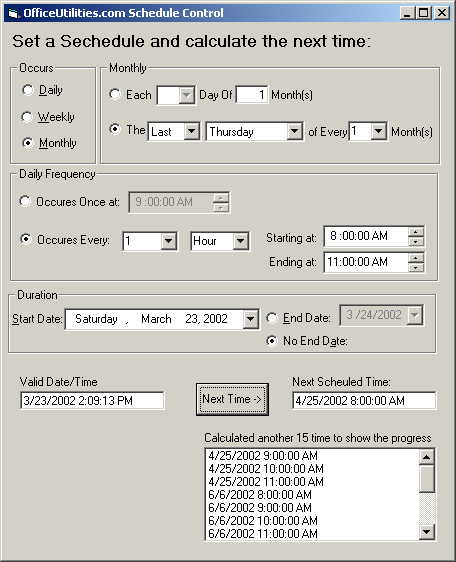



## Great Schedule Control

### Description

Here is a great little piece of code that will be VERY useful for anyone needing to schedule something. The interface is based on SQL Server’s schedule, but the code is 100% VB. It will schedule almost all possibilities.

Included is XML code because I am also coming out with a Web version based on (XML/XSL) with VB or ASP in the back to calculate the Next Time. So if there is interest for the web, just let me know.

** After reading a comment about not enough professional business code samples on PCS, I thought it time that I contribute. I have use many samples from here over the years and I just wanted to give back.

Enjoy!!!
 
### More Info
 

             |
---                |---
**Submitted On**   |2002-03-23 14:14:14
**By**             |[Todd Fabacher](https://github.com/Planet-Source-Code/PSCIndex/blob/master/ByAuthor/todd-fabacher.md)
**Level**          |Advanced
**User Rating**    |4.9 (89 globes from 18 users)
**Compatibility**  |VB 4\.0 \(16\-bit\), VB 5\.0, VB 6\.0
**Category**       |[Math/ Dates](https://github.com/Planet-Source-Code/PSCIndex/blob/master/ByCategory/math-dates__1-37.md)
**World**          |[Visual Basic](https://github.com/Planet-Source-Code/PSCIndex/blob/master/ByWorld/visual-basic.md)
**Archive File**   |[Great\_Sche648193232002\.zip](https://github.com/Planet-Source-Code/todd-fabacher-great-schedule-control__1-32995/archive/master.zip)

